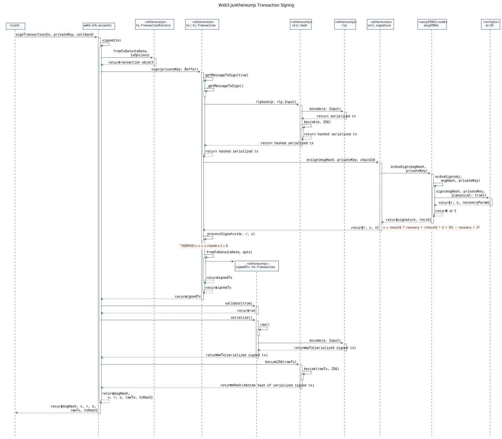

### ECDSA Signing

* [RFC-6979: Deterministic Usage of the DSA and ECDSA](https://datatracker.ietf.org/doc/html/rfc6979)
    * Defines a deterministic digital signature generation procedure.

* [ECDSA sign](https://cryptobook.nakov.com/digital-signatures/ecdsa-sign-verify-messages#ecdsa-sign)
    * Calculate the message hash ***`h`***
    * Generate a random number ***`k`***
    * Calculate the random point ***`R`*** from ***`k`*** and take its x-coordinate ***`r`***
        * ***`R`*** = ***`k`*** * **`G`**
        * ***`r`*** = ***`R`*** .**`x`**
    * Calculate the signature proof ***`s`*** from message hash( ***`h`*** ), random number( ***`k`*** ), random point( ***`r`*** ) and private key
        * ***`s`*** = ***`k`*** -1 * ( ***`h`*** + ***`r`*** * ***`prvKey`*** ) (<tt>mod ***n***</tt>)
    * Return the signature ( ***`r`*** , ***`s`*** )

* [ECDSA signature generation algorithm](https://en.wikipedia.org/wiki/Elliptic_Curve_Digital_Signature_Algorithm#Signature_generation_algorithm)
    * Calculate ***`e`*** = `HASH`( ***`m`*** )
    * Select a cryptographically secure random integer ***`k`***
    * Calculate the curve point ( ***`x`*** , ***`y`*** ) = ***`k`*** * **`G`**
    * Calculate ***`r`*** = ***`x`*** <tt>mod</tt> **`n`**
    * Calculate ***`s`*** = ***`k`*** -1 ( *`z`* + ***`r`*** * ***<code>dA</code>*** )
    * ( ***`r`*** , ***`s`*** ) is signature
        * ( ***`r`*** , ***`-s`*** <tt>mod</tt> `n`) is also valid signature

----

### Ethereum Signing

* Transaction signing in practice
    * Create a transaction data structure, containing 9 fields: `[nonce, gasPrice, gasLimit, to, value, data, chainID, 0, 0]`
    * Produce an RLP-encoded serialized message of the transaction data structure
    * Compute the Keccak256 hash of this serialized message
    * Compute the ECDSA signature, signing the hash with the originating EOA’s private key.
    * Append the ECDSA signature’s computed v, r, and s values to the transaction.

* Ethereum signature
    * `v` of the signature **MUST** be set to `{0,1} + CHAIN_ID * 2 + 35` where `{0,1}` is the parity of the `y` value of the curve point
for which `r` is the x-value in the secp256k1 signing process. ([EIP-155](https://eips.ethereum.org/EIPS/eip-155))
    * It is assumed that `v` is the ‘recovery identifier’. The recovery identifier is a 1 byte value
specifying the parity and finiteness of the coordinates of the curve point for which `r` is the x-value; this
value is in the range of `[0, 3]`, however we declare the upper two possibilities, representing infinite values, invalid. The
value `0` represents an **even y** value and `1` represents an **odd y** value. ([Ethereum White Paper - Berlin Version](https://ethereum.github.io/yellowpaper/paper.pdf))

#### web3.js/ethereumjs

|  |
| ------ |

* [`Accounts.prototype.signTransaction(tx, privateKey, callback)`](https://github.com/ChainSafe/web3.js/blob/v1.7.0/packages/web3-eth-accounts/src/index.js#L146)
    * [`signed(tx)`](https://github.com/ChainSafe/web3.js/blob/v1.7.0/packages/web3-eth-accounts/src/index.js#L182)
        * [`TransactionFactory.fromTxData(txData, txOptions)`](https://github.com/ethereumjs/ethereumjs-monorepo/blob/@ethereumjs/tx@3.3.2/packages/tx/src/transactionFactory.ts#L22)
        * [`tx.sign(privateKey: Buffer)`](https://github.com/ethereumjs/ethereumjs-monorepo/blob/@ethereumjs/tx@3.3.2/packages/tx/src/baseTransaction.ts#L282)
            * [`tx.getMessageToSign(true)`](https://github.com/ethereumjs/ethereumjs-monorepo/blob/6e41fb32a4916cff53ec940d94e3c238f3c20d5f/packages/tx/src/legacyTransaction.ts#L210)
                * [`util.hash.rlphash(input)`](https://github.com/ethereumjs/ethereumjs-monorepo/blob/6e41fb32a4916cff53ec940d94e3c238f3c20d5f/packages/util/src/hash.ts#L157)
                    * [`rlp.encode(input)`](https://github.com/ethereumjs/rlp/blob/a0fc75b76e08939d9db5162640ba4363f6ce296e/src/index.ts#L14)
                * [`util.hash.keccak(a: Buffer)`](https://github.com/ethereumjs/ethereumjs-monorepo/blob/6e41fb32a4916cff53ec940d94e3c238f3c20d5f/packages/util/src/hash.ts#L12)
            * [`util.signature.ecsign(msgHash, privateKey, chainId)`](https://github.com/ethereumjs/ethereumjs-monorepo/blob/6e41fb32a4916cff53ec940d94e3c238f3c20d5f/packages/util/src/signature.ts#L25)
                * `const v = chainId ? recovery + (chainId * 2 + 35) : recovery + 27`
            * [`tx._processSignature(v, r, s)`](https://github.com/ethereumjs/ethereumjs-monorepo/blob/6e41fb32a4916cff53ec940d94e3c238f3c20d5f/packages/tx/src/legacyTransaction.ts#L301)
                * `v = v+ chainId * 2 + 8`
                * [`Transaction.fromTxData(txData, opts)`](https://github.com/ethereumjs/ethereumjs-monorepo/blob/6e41fb32a4916cff53ec940d94e3c238f3c20d5f/packages/tx/src/legacyTransaction.ts#L33)

##### Web3j

|  |
| ------ |

* [`org.web3j.tx.RawTransactionManager.sendTransaction()`](https://github.com/web3j/web3j/blob/v4.8.8/core/src/main/java/org/web3j/tx/RawTransactionManager.java#L111)
* [`org.web3j.crypto.RawTransaction.createTransaction()`](https://github.com/web3j/web3j/blob/v4.8.8/crypto/src/main/java/org/web3j/crypto/RawTransaction.java#L85)
* [`org.web3j.crypto.transaction.type.LegacyTransaction.createTransaction()`](https://github.com/web3j/web3j/blob/v4.8.8/crypto/src/main/java/org/web3j/crypto/transaction/type/LegacyTransaction.java#L128)
* [`org.web3j.crypto.transaction.type.LegacyTransaction.LegacyTransaction()`](https://github.com/web3j/web3j/blob/v4.8.8/crypto/src/main/java/org/web3j/crypto/transaction/type/LegacyTransaction.java#L52)
* [`org.web3j.crypto.RawTransaction.RawTransaction()`](https://github.com/web3j/web3j/blob/v4.8.8/crypto/src/main/java/org/web3j/crypto/RawTransaction.java#L31)
* [`org.web3j.tx.RawTransactionManager.signAndSend()`](https://github.com/web3j/web3j/blob/v4.8.8/core/src/main/java/org/web3j/tx/RawTransactionManager.java#L193)
* [`org.web3j.tx.RawTransactionManager.sign()`](https://github.com/web3j/web3j/blob/v4.8.8/core/src/main/java/org/web3j/tx/RawTransactionManager.java#L180)
* [`org.web3j.crypto.TransactionEncoder.signMessage()`](https://github.com/web3j/web3j/blob/v4.8.8/crypto/src/main/java/org/web3j/crypto/TransactionEncoder.java#L42)
* [`org.web3j.crypto.TransactionEncoder.encode()`](https://github.com/web3j/web3j/blob/v4.8.8/crypto/src/main/java/org/web3j/crypto/TransactionEncoder.java#L83)
* [`org.web3j.crypto.Sign.SignatureData()`](https://github.com/web3j/web3j/blob/v4.8.8/crypto/src/main/java/org/web3j/crypto/Sign.java#L340)
* ...

